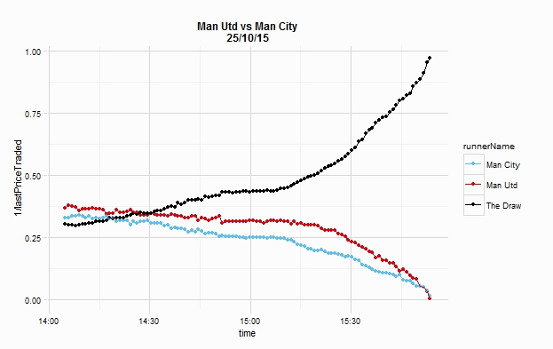

betfaiR v0.5
=======

This package likely still needs a little work, but you can use it to place a bet with the `placeOrders` method.  Please proceed with caution when placing any bets, and if you encounter any issues let me know.

#### Installation

```R
# install devtools
devtools::install_github("durtal/betfaiR")
```

#### Help

There are help pages available [here](http://durtal.github.io/betfaiR/), and issues can be filed [here](https://github.com/durtal/betfaiR/issues), and a vignette showing how to [login, find a market, place a bet, replace the bet and cancel the bet](http://durtal.github.io/betfaiR/vignette_one.html).  Help with the package would be welcome, or suggestions on how best to parse the responses from Betfair, what format would _you_ like data to be in when returned from the Exchange, dataframes, lists of dataframes, environments (maybe?) or the raw unparsed response.

#### Usage

The primary function in **betfaiR** is `betfair`, which takes three arguments, your username, your password, and an application key (see [here](https://api.developer.betfair.com/services/webapps/docs/display/1smk3cen4v3lu3yomq5qye0ni/Application+Keys) on how to get a key).

```R
bf <- betfair(usr = "USERNAME",
              pwd = "PASSWORD",
              key = "APP_KEY")
```

The `betfair` function returns an environment with various methods, you can inspect you session token (required by Betfair for all methods) via the following:

```R
bf$session()
## Session Token: "some_session_token"
```

There is a login in method returned into the `bf` environment, allowing users to login in again if something went wrong initially, this function stores the new details in an hidden object within the environment, and updates the session token.

```R
bf$login(usr = "USERNAME2", pwd = "PASSWORD", key = "APP_KEY")
```

The view the available methods, simply print the environment `bf`

```R
<betfaiR API>
Methods available:
    $cancelOrders(..., marketId = NA)
    $clearedOrders(betStatus = "SETTLED", eventTypeIds = NULL, eventIds = NULL, marketIds = NULL, runnerIds = NULL,
   betIds = NULL, side = "BACK", from = NULL, to = NULL)
    $competitions(filter = marketFilter())
    $countries(filter = marketFilter())
    $currentOrders(betId = NULL, marketId = NULL, orderProjection = "ALL", from = NULL, to = NULL, orderBy = "BY_BET",
   sort = "EARLIEST_TO_LATEST", fromRecord = NULL, count = NULL)
    $events(filter = marketFilter())
    $eventTypes(filter = marketFilter())
    $login(usr, pwd, key)
    $marketBook(marketIds = list(), priceProjection = "EX_BEST_OFFERS", orderProjection = "EXECUTABLE", matchProjection = "NO_ROLLUP")
    $marketCatalogue(filter = marketFilter(), marketProjection = "EVENT", sort = NULL, maxResults = 1, keepRules = FALSE)
    $marketPnL(marketIds, settled = NULL, bsp = NULL, NET = NULL)
    $marketTypes(filter = marketFilter())
    $placeOrders(marketId, selectionId, orderType = "LIMIT", handicap = NULL, side = "BACK", order = limitOrder())
    $replaceOrders(..., marketId)
    $session()
    $updateOrders(..., marketId)
    $venues(filter = marketFilter())
```

So, if you are familiar with Betfair's API, you will realise the available methods in the package might need a little bit of work.  Each of the methods has its own help page, so to view the help page of the events method, `?events`.

`marketBook` can be used, but because the data returned is often heavily nested, it might not parse the response from betfair as well as other methods.  The response from `marketBook` does include the raw response if required, as an element in a list.

Some of the available methods have a `filter` parameter, which can be used to filter data, this is then added into the body of the request sent to Betfair.  The `marketFilter` function helps you build a filter object, providing all the available parameters that can be filtered by (this hasn't been tested exhaustively but should work).  For example to find horse racing events:

```R
racing <- bf$events(filter = marketFilter(eventTypeIds = 7))
```

The `racing` object is now a dataframe of horse racing events, providing data that includes the event Id, event name, countryCode, timezone, venue, date, and the number of markets.

### PASSWORD and KEY

The appendix **_API key best practices_** in the [api packages vignette](https://cran.r-project.org/web/packages/httr/vignettes/api-packages.html) from the [httr](https://github.com/hadley/httr) package provides some pertinent advice for the storing of you PASSWORD and KEY.

The advice is to store your PASSWORD and KEY, or any other variables that should be kept safe, in an environment variable, this is to prevent accidentally sharing your credentials, either by sharing an .Rhistory file, or sharing a workspace.

### example

The plot below is data collected from betfair using the `marketCatalogue` and `marketBook` methods.  The `marketBook` method is still a work in progress, it returns a list with data as organised as possible, but it also returns the raw response from Betfair, which is converted from json into a list.  Data was collected at minute intervals from when the game kicked off, via a simple for loop and then plotted.


